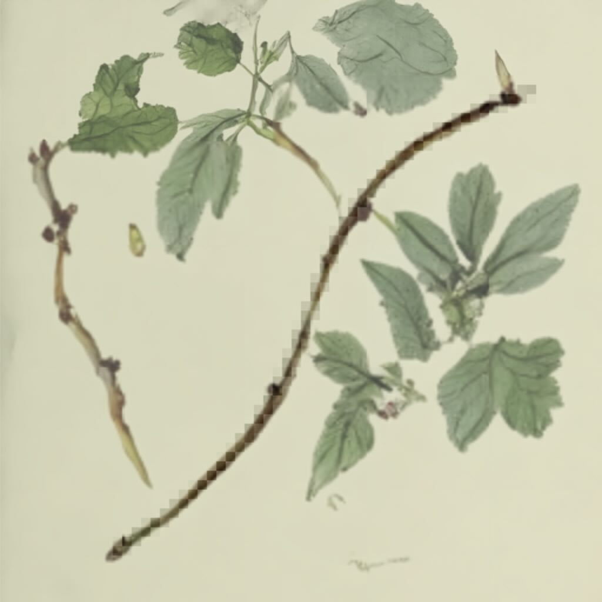

## Dino Diffusion: Bare-bones Diffusion in p5.js

*This project is heavily based on ["Dino Diffusion": Bare-bones Diffusion Models](https://madebyoll.in/posts/dino_diffusion/) by [Ollin Boer Bohan](https://madebyoll.in/).*

* Uses [p5.js v.1.10.0](https://p5js.org/) by the Processing Foundation
* Uses the [ONNX Runtime Web v1.18.0](https://onnxruntime.ai/) by Microsoft

To understand how diffusion models generate images, [Ollin Boer Bohan](https://madebyoll.in/) wrote [PyTorch code](https://github.com/madebyollin/dino-diffusion) to train an extremely simple, bare-bones diffusion model. Bohan trained a tiny diffusion model that generates 512×512 botanical images in the browser. You can play with Bohan's [demo here](https://madebyoll.in/posts/dino_diffusion/demo). The version in this project is a port of Bohan's JavaScript-based front end to p5.js, allowing for new types of tinkering.

A p5.js demo of this project can be found [here, at OpenProcessing.org](https://openprocessing.org/sketch/2321795). Note that this demo loads a trained model file which is approximately 8MB. 

